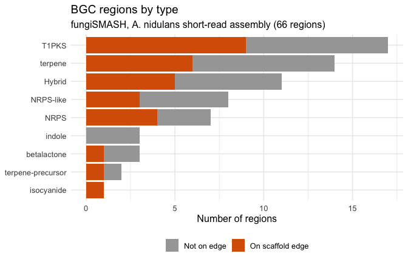

BGC types in the A. nidulans assembly
================
Hosea
2026-10-03

Cluster types from fungiSMASH (antiSMASH 8.0.4), split by whether each
region sits on a scaffold edge.

## Packages

``` r
library(ggplot2)
```

## Load the data

``` r
data_file <- "../08_antismash/antismash_regions.tsv"
file.exists(data_file)
```

    ## [1] TRUE

``` r
regions <- read.delim(data_file, colClasses = c(label = "character"))
```

## Inspecting the data

``` r
str(regions)
```

    ## 'data.frame':    66 obs. of  4 variables:
    ##  $ label      : chr  "1.1" "3.1" "4.1" "4.2" ...
    ##  $ length_bp  : int  67343 78743 31253 65562 65546 92532 30633 31410 30867 63770 ...
    ##  $ products   : chr  "NRPS" "T1PKS" "terpene" "T1PKS" ...
    ##  $ contig_edge: chr  "False" "False" "False" "False" ...

## Tidy the data

``` r
regions$contig_edge <- as.logical(regions$contig_edge)

regions$type <- ifelse(grepl("+", regions$products, fixed = TRUE),
                       "Hybrid", regions$products)

regions$edge <- ifelse(regions$contig_edge, "On scaffold edge", "Not on edge")

type_order <- names(sort(table(regions$type)))
regions$type <- factor(regions$type, levels = type_order)

table(regions$type, regions$edge)
```

    ##                    
    ##                     Not on edge On scaffold edge
    ##   isocyanide                  0                1
    ##   terpene-precursor           1                1
    ##   betalactone                 2                1
    ##   indole                      3                0
    ##   NRPS                        3                4
    ##   NRPS-like                   5                3
    ##   Hybrid                      6                5
    ##   terpene                     8                6
    ##   T1PKS                       8                9

## Plot

``` r
ggplot(regions, aes(x = type, fill = edge)) +
  geom_bar() +
  coord_flip() +
  scale_fill_manual(values = c("Not on edge" = "grey65",
                               "On scaffold edge" = "#D95F02")) +
  labs(x = NULL, y = "Number of regions", fill = NULL,
       title = "BGC regions by type",
       subtitle = "fungiSMASH, A. nidulans short-read assembly (66 regions)") +
  theme_minimal(base_size = 12) +
  theme(legend.position = "bottom")
```

<!-- -->

## Interpretation

PKS and NRPS regions were the most affected by assembly fragmentation: 9
of 17 T1PKS and 4 of 7 NRPS regions sit on a scaffold edge. Their core
genes are long, so these clusters are more likely to cross a break in a
short-read assembly.
